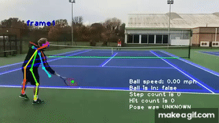

# **Possibilidades de Aplicações: Visão Computacional**

A **visão computacional** é uma área da inteligência artificial que ensina computadores a “enxergar” e interpretar imagens e vídeos.  
Isso permite criar soluções práticas para o dia a dia, desde segurança até automação de processos.

---

## **1. Delimitação de Áreas de Interesse**

É possível marcar áreas específicas em uma imagem ou vídeo (como um quadrado ou região de interesse) e monitorar o que acontece dentro delas.  
Alguns exemplos de uso:
- Detectar quando alguém entra em uma área proibida.
- Contar quantas pessoas ou veículos passam por uma região.
- Acionar um alarme ou equipamento quando algo é detectado naquela área.

---

## **2. Detecção de Objetos**

Um dos usos mais comuns é **detectar objetos de interesse** em imagens ou vídeos.  
Isso pode ser feito em tempo real e para praticamente qualquer coisa: pessoas, carros, animais, máquinas, etc.

Exemplos práticos:
- Detectar pessoas em uma câmera de segurança.  
- Identificar veículos em movimento.  
- Contar objetos em uma linha de produção.

---

## **3. Reconhecimento Facial**

A tecnologia pode identificar **quem é a pessoa** em frente à câmera, comparando com um banco de dados de rostos cadastrados.  
Exemplos de uso:
- Controle de acesso (abrir portas/portões automaticamente).  
- Registro de presença em empresas ou escolas.  
- Sistemas de autenticação sem senha.

---

## **4. Classificação de Imagens**

Aqui, a visão computacional é usada para **dizer o que existe dentro de uma imagem**.  
Exemplos:
- Diferenciar se uma imagem contém um gato ou um cachorro.  
- Classificar frutas em uma esteira de produção.  
- Identificar peças defeituosas em uma fábrica.

---

## **5. Leitura de Textos (OCR)**

A visão computacional também consegue **ler textos em imagens ou documentos**.  
Exemplos:
- Digitalizar notas fiscais automaticamente.  
- Ler placas de veículos em estradas.  
- Transformar fotos de documentos em texto editável.

---

## **6. Aplicações Criativas**

Além do lado técnico, também existem usos criativos:  
- Filtros de realidade aumentada em redes sociais.  
- Jogos que usam câmera para capturar movimentos.  
- Aplicações de arte digital baseadas em imagens.

---

## **7. Detecção de Trajetória de Objetos**

Além de identificar objetos, também é possível **rastrear e entender o caminho (trajetória)** que eles percorrem em uma cena.  
Isso é muito útil para análises mais detalhadas.

Exemplos práticos:
- Monitorar o trajeto de veículos em ruas ou rodovias.  
- Rastrear a movimentação de jogadores em um campo de futebol.  
- Analisar como máquinas ou pessoas se deslocam dentro de uma fábrica.  
- Detectar padrões de comportamento (ex.: pessoas andando em áreas suspeitas). 

